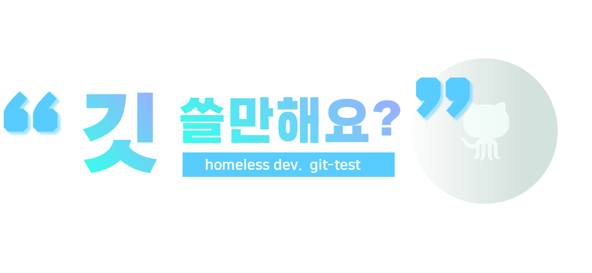

# git-test

 

## 1. VCS의 개념
 **버전관리 시스템(Version Control System)**  :  
 파일 변화를 시간에 따라 기록했다가 이후에 특정 시점의 버전을 다시 꺼내올 수 있는 시스템이다.
 동일한 정보에 대한 여러 버전을 관리하게 되며, 버전을 통해 시간적으로 변경 사항과 변경 사항을 작성한 작업자를 추적할 수 있다.
 여기서 버전이란 의미있는 변화(기능의 개선, 버그 수정)를 의미한다.
   
 **분산 버전 관리 시스템(Distributed Version Control System)**  :  
 클라이언트가 파일의 마지막 스냅샷을 가져오는 것이 아니라 저장소 자체를 복제하게 된다.
 서버에 문제가 생길 경우 이 복제물로 작업이 가능하며 서버를 복원할 수도 있다. 또한 리모트 저장소가 존재하며 리모트 저장소가 많을 수도 있다.
 즉, 동시에 다양한 그룹과 다양한 방법으로 협업이 가능하다. git은 분산 버전 관리 시스템이다.

## 2. Git 용어 정리
 **Git** :  
 **깃(Git)** 은 컴퓨터 파일의 변경사항을 추적하고 여러명의 사용자들 간에 해당 파일들의 작업을 조율하기 위한 분산 버전 관리시스템이다. 
 온라인으로 파일을 보관하고, 파일의 변경 사항을 기록하여 수정된 내용을 확인할 수 있고, 다른 개발자와 협업으로 개발을 할 수 있게 해준다.
 
 

 **Git 저장소** :  
 &emsp;&emsp;&emsp; - **원격 저장소 (Remote Repository)** : 파일이 원격 저장소 전용 서버에서 관리되며 여러 사람이 함께 공유할 수 있다.  
 &emsp;&emsp;&emsp; - **로컬 저장소 (Local Repository)** : 개인 PC에 파일이 저장되는 개인 저장소이다. 
 
 **Commit** : 저장소에서 변경된 내용을 기록하는 과정   
 **Push** : 로컬 저장소에서 변경된 내용을 원격 저장소에 업데이트 하는 과정   
 **Pull** : 원격 저장소의 버전이 로컬 저장소의 버전보다 높은 경우, 원격 저장소의 버전으로 로컬 저장소를 업데이트 하는 과정  
 **Branch** : 현재 작업중인 내용과 별개로 작업하는 경우 새로운 브랜치를 생성, 주로 새로운 기능을 추가하거나 다른 개발자와 협업하는 경우 사용
   
 **Merge** : 두 개의 브랜치를 합치는 과정, 각 브랜치에서 한 파일에 대해 수정한 경우 어느 브랜치의 내용을 반영할 건지를 고려해야한다.
 
 
